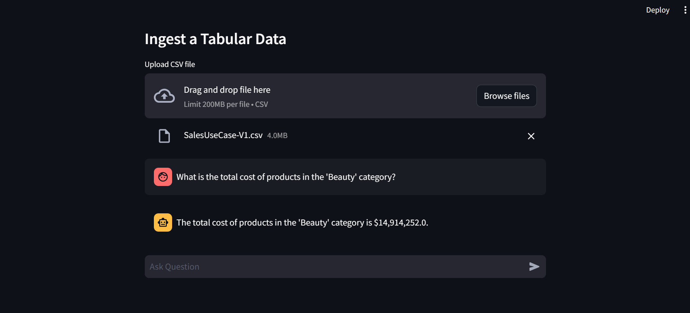

# ChatterChum: Streamlit-based Chat Assistant for SQL Queries

ChatterChum is a Streamlit-based web application that serves as a chat assistant for generating SQL queries based on user questions and datasets uploaded in CSV format. The assistant utilizes the GenerativeAI model Gemini to understand user queries and generate SQL commands accordingly.

## Features

- **Upload CSV**: Users can upload CSV files containing their datasets.
- **Chat Interface**: Users can ask questions in natural language through a chat interface.
- **SQL Query Generation**: ChatterChum converts user questions into SQL queries based on the dataset columns and their content.
- **Gemini Integration**: Utilizes the GenerativeAI model Gemini for natural language processing and response generation.
- **SQL Execution**: Executes generated SQL queries on the uploaded dataset.
- **Real-time Chat History**: Maintains a real-time chat history for better interaction and reference.

## Screenshots





## Installation

1. Clone this repository:

    ```
    git clone https://github.com/YourUsername/ChatterChum.git
    ```


2. Set up the Google API key:
   
    - Obtain a Google API key and set it in the environment variable `GOOGLE_API_KEY`.
    - Example: `export GOOGLE_API_KEY=YourAPIKey`

3. Run the application:

    ```
    streamlit run main.py
    ```

## Usage

1. Upload your dataset in CSV format.
2. Ask questions related to the dataset in the chat interface.
3. ChatterChum will generate SQL queries based on your questions and execute them on the dataset.
4. Receive SQL query results and responses in the chat interface.


